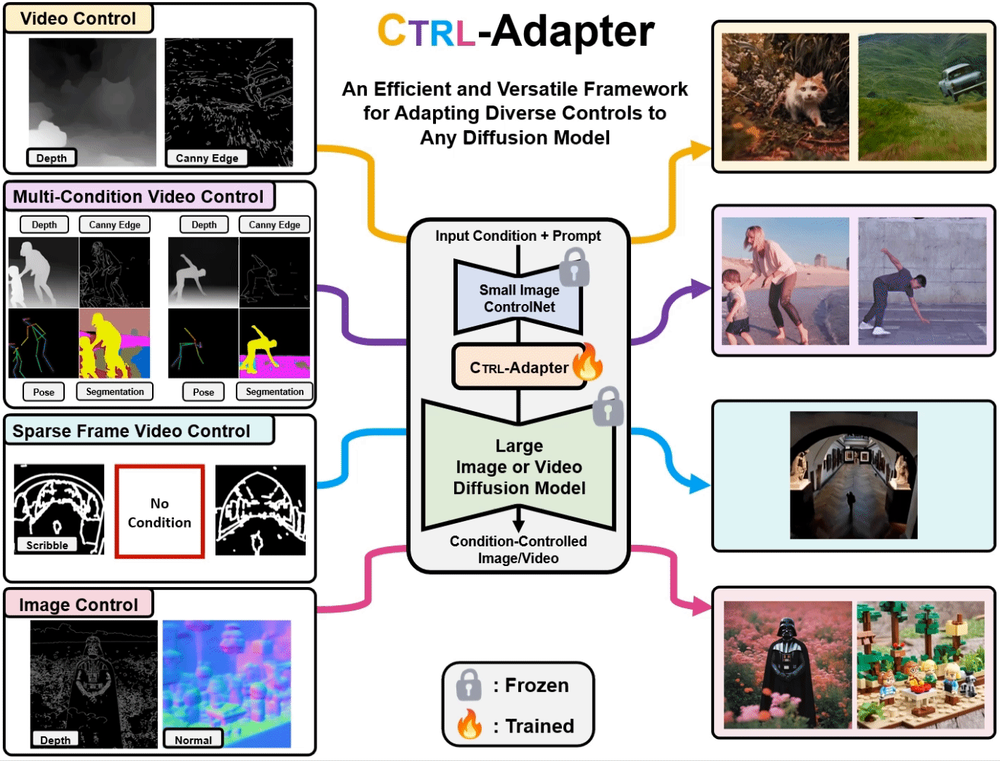
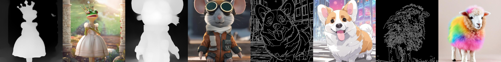

# Ctrl-Adapter: An Efficient and Versatile Framework for Adapting Diverse Controls to Any Diffusion Model

Official implementation of **Ctrl-Adapter**, an efficient and versatile framework that adds diverse controls
to any image/video diffusion models by adapting pretrained ControlNets.


[](https://arxiv.org/abs/2404.09967) 
[](https://ctrl-adapter.github.io/)
[](https://huggingface.co/hanlincs/ctrl-adapter)


[Han Lin](https://hl-hanlin.github.io/),
[Jaemin Cho](https://j-min.io),
[Abhay Zala](https://aszala.com/),
[Mohit Bansal](https://www.cs.unc.edu/~mbansal/)


<br>

<br>


CTRL-Adapter is an efficient and versatile framework for adding diverse
spatial controls to any image or video diffusion model. It supports a variety of useful
applications, including video control, video control with multiple conditions, video control with
sparse frame conditions, image control, zero-shot transfer to unseen conditions, and video editing.

# 🔥 News
- **Apr. 30, 2024**. Training code released now! It's time to train Ctrl-Adapter on your desired backbone! 🚀🚀
- **Apr. 29, 2024**. **[SDXL](https://stability.ai/news/stable-diffusion-sdxl-1-announcement)**, **[I2VGen-XL](https://i2vgen-xl.github.io/)**, and **[SVD](https://stability.ai/news/stable-video-diffusion-open-ai-video-model)** inference code and checkpoints are all released!


# 🔧 Setup

### Environment Setup

If you only need to perform inference with our code, please install from ```requirements_inference.txt```. To make our codebase easy to use, the primary libraries that need to be installed are Torch, Diffusers, and Transformers. Specific versions of these libraries are not required; the default versions should work fine :)

If you are planning to conduct training, please install from ```requirements_train.txt``` instead, which contains more dependent libraries needed.


```shell
conda create -n ctrl-adapter python==3.10
conda activate ctrl-adapter
pip install -r requirements_inference.txt # install from this if you only need to perform inference
pip install -r requirements_train.txt # install from this if you plan to do some training
```


Here we list several questions that we believe important when you start using this 

# 🔮 Inference

We provde model checkpoints and inference scripts for Ctrl-Adapter trained on SDXL, I2VGen-XL, and SVD. 
All inference scripts are put under ```./inference_scripts```.

### 📌 Notice Before You Begin

Please note that there is usually no single model that excels at generating images/videos for all motion styles across various control conditions.

Different image/video generation backbones may perform better with specific types of motion. For instance, we have observed that SVD excels at slide motions, while it generally performs worse than I2VGen-XL with complex motions (this is consistent wtih the findings in [DynamiCrafter](https://www.youtube.com/watch?v=0NfmIsNAg-g)). Additionally, using different control conditions can lead to significantly different results in the generated images/videos, and some control conditions may be more informative than others for certain types of motion.


### 📌 Inference Data Structure

We put some sample images/frames for inference under the folder ```./assets/evaluation```. You can add your custom examples following the same file structure illustrated below. 

For model inference, we support two options:
- If you already have condition image/frames extracted from some image/video, you can use inference (w/ extracted condition).

```bash
./assets/evaluation/images
    ├── depth
    │   ├── anime_corgi.png
    ├── raw_input
    │   ├── anime_corgi.png
    ├── captions.json

./assets/evaluation/frames
    ├── depth
    │   ├── newspaper_cat
    │   │   ├── 00000.png
    │   │   ├── 00001.png
    │   │   ...
    │   │   ├── 00015.png
    ├── raw_input
    │   ├── newspaper_cat
    │   │   ├── 00000.png # only the 1st frame is needed for I2V models
    ├── captions.json
```


- If you haven't extracted control conditions and only have the raw image/frames, you can use inference (w/o extracted condition). In this way, our code can automatically extract the control conditions from the input image/frames and then generate corresponding image/video.

```bash
./assets/evaluation/images
    ├── raw_input
    │   ├── anime_corgi.png
    ├── captions.json

./assets/evaluation/frames
    ├── raw_input
    │   ├── newspaper_cat
    │   │   ├── 00000.png
    │   │   ├── 00001.png
    │   │   ...
    │   │   ├── 00015.png
    ├── captions.json
```


### 📌 Run Inference Scripts

Here is a sample command to run inference on SDXL with depth map as control (w/ extracted condition).

```
sh inference_scripts/sdxl/sdxl_inference_depth.sh
```

⚠️  ```--control_guidance_end```: this is the most important parameter that balances generated image/video quality with control strength. If you notice the generated image/video does not follow the spatial control well, you can increase this value; and if you notice the generated image/video quality is not good because the spatial control is too strong, you can decrease this value. Detailed discussion of control strength via this parameter is shown in our paper.

We list the inference scripts for different tasks mentioned in our paper as follows ⬇️

## Controllable Image Generation 

<br>

<br>


### SDXL


| Control Conditions    | Checkpoints | Inference (w/ extracted condition) | Inference (w/o extracted condition) |
|-----------|------|---------|--------|
| Depth Map      | <a href="https://huggingface.co/hanlincs/Ctrl-Adapter/tree/main/sdxl_depth">HF link</a> | [command](/inference_scripts/sdxl/sdxl_inference_depth.sh)    | [command](/inference_scripts/sdxl/sdxl_inference_extract_depth_from_raw_image.sh)   |
| Canny Edge     | <a href="https://huggingface.co/hanlincs/Ctrl-Adapter/tree/main/sdxl_canny">HF link</a> | [command](/inference_scripts/sdxl/sdxl_inference_canny.sh)    | [command](/inference_scripts/sdxl/sdxl_inference_extract_canny_from_raw_images.sh)   |
| Soft Edge     | <a href="https://huggingface.co/hanlincs/Ctrl-Adapter/tree/main/sdxl_softedge">HF link</a> | [command](/inference_scripts/sdxl/sdxl_inference_softedge.sh)    | [command](/inference_scripts/sdxl/sdxl_inference_extract_softedge_from_raw_images.sh)   |
| Normal Map     | <a href="https://huggingface.co/hanlincs/Ctrl-Adapter/tree/main/sdxl_normal">HF link</a> | [command](/inference_scripts/sdxl/sdxl_inference_normal.sh)    | [command](/inference_scripts/sdxl/sdxl_inference_extract_normal_from_raw_images.sh)   |
| Segmentation     | <a href="https://huggingface.co/hanlincs/Ctrl-Adapter/tree/main/sdxl_segmentation">HF link</a> | [command](/inference_scripts/sdxl/sdxl_inference_segmentation.sh)    | [command](/inference_scripts/sdxl/sdxl_inference_extract_segmentation_from_raw_images.sh)   |
| Scribble     | <a href="https://huggingface.co/hanlincs/Ctrl-Adapter/tree/main/sdxl_scribble">HF link</a> | [command](/inference_scripts/sdxl/sdxl_inference_scribble.sh)    | [command](/inference_scripts/sdxl/sdxl_inference_extract_scribble_from_raw_images.sh)   |
| Lineart     | <a href="https://huggingface.co/hanlincs/Ctrl-Adapter/tree/main/sdxl_lineart">HF link</a> | [command](/inference_scripts/sdxl/sdxl_inference_lineart.sh)    | [command](/inference_scripts/sdxl/sdxl_inference_extract_lineart_from_raw_images.sh)   |


## Controllable Video Generation

<br>
<div>
    
    
</div>
<br>


### I2VGen-XL

| Control Conditions    | Checkpoints | Inference (w/ extracted condition) | Inference (w/o extracted condition) |
|-----------|------|---------|--------|
| Depth Map      | <a href="https://huggingface.co/hanlincs/Ctrl-Adapter/tree/main/i2vgenxl_depth">HF link</a>    | [command](/inference_scripts/i2vgenxl/i2vgenxl_inference_depth.sh)       | [command](/inference_scripts/i2vgenxl/i2vgenxl_inference_extract_depth_from_raw_frames.sh)   |
| Canny Edge     | <a href="https://huggingface.co/hanlincs/Ctrl-Adapter/tree/main/i2vgenxl_canny">HF link</a>    | [command](/inference_scripts/i2vgenxl/i2vgenxl_inference_canny.sh)       | [command](/inference_scripts/i2vgenxl/i2vgenxl_inference_extract_canny_from_raw_frames.sh)   |
| Soft Edge      | <a href="https://huggingface.co/hanlincs/Ctrl-Adapter/tree/main/i2vgenxl_softedge">HF link</a> | [command](/inference_scripts/i2vgenxl/i2vgenxl_inference_softedge.sh)    | [command](/inference_scripts/i2vgenxl/i2vgenxl_inference_extract_softedge_from_raw_frames.sh)   |


### SVD

| Control Conditions    | Checkpoints | Inference (w/ extracted condition) | Inference (w/o extracted condition) |
|-----------|------|---------|--------|
| Depth Map      | <a href="https://huggingface.co/hanlincs/Ctrl-Adapter/tree/main/svd_depth">HF link</a>    | [command](/inference_scripts/svd/svd_inference_depth.sh)       | [command](/inference_scripts/svd/svd_inference_extract_depth_from_raw_frames.sh)   |
| Canny Edge     | <a href="https://huggingface.co/hanlincs/Ctrl-Adapter/tree/main/svd_canny">HF link</a>    | [command](/inference_scripts/svd/svd_inference_canny.sh)       | [command](/inference_scripts/svd/svd_inference_extract_canny_from_raw_frames.sh)   |
| Soft Edge      | <a href="https://huggingface.co/hanlincs/Ctrl-Adapter/tree/main/svd_softedge">HF link</a> | [command](/inference_scripts/svd/svd_inference_softedge.sh)    | [command](/inference_scripts/svd/svd_inference_extract_softedge_from_raw_frames.sh)   |


## Video Generation with Multi-Condition Control

<br>

<br>

We currently implemented multi-condition control on **I2VGen-XL**. The following checkpoint are trained on 7 control conditions, including depth, canny, normal, softedge, segmentation, lineart, and openpose. Here are the sample inference scripts that uses depth, canny, segmentation, and openpose as control conditions.

| Adapter Checkpoint    | Router Checkpoint | Inference (w/ extracted condition) | Inference (w/o extracted condition) |
|-----------|------|---------|--------|
| <a href="https://huggingface.co/hanlincs/Ctrl-Adapter/tree/main/i2vgenxl_multi_control_adapter">HF link</a>      | <a href="https://huggingface.co/hanlincs/Ctrl-Adapter/tree/main/i2vgenxl_multi_control_router">HF link</a>    | [command](/inference_scripts/i2vgenxl/i2vgenxl_inference_depth_canny_segmentation_openpose.sh)       | [command](/inference_scripts/i2vgenxl/i2vgenxl_inference_extract_depth_canny_segmentation_openpose_from_raw_frames.sh)   |


## Video Generation with Sparse Control

<br>

<br>

Here we provide a sample inference script that uses user scribbles as condition, and 4 out of 16 frames for sparse control.

| Control Conditions    | Checkpoint | Inference (w/ extracted condition) |
|-----------|------|---------|
| Scribbles      | <a href="https://huggingface.co/hanlincs/Ctrl-Adapter/tree/main/i2vgenxl_scribble_sparse">HF link</a>    | [command](/inference_scripts/i2vgenxl/i2vgenxl_inference_scribble_sparse.sh)       |


# 🚅 How To Train 

🎉 To make our method reproducible and adaptable to new backbones, we have released all of our training code :) 

You can find detailed training guideline for Ctrl-Adapter [here](/assets/train_guideline.md)! 


# 📝 TODO List
- [x] Release environment setup, inference code, and model checkpoints.
- [x] Release training code.
- [x] Training guideline to adapt our Ctrl-Adapter to new image/video diffusion models.
- [ ] Ctrl-Adapter + DiT-based image/video generation backbones. (**WIP**)
- [ ] Release evaluation code.

💗 Please let us know in the issues or PRs if you're interested in any relevant backbones or down-stream tasks that can be implemented by our Ctrl-Adapter framework! Welcome to collaborate and contribute!

# 📚 BibTeX

🌟 If you find our project useful in your research or application development, citing our paper would be the best support for us! 

```
@misc{lin2024ctrladapter,
      title={Ctrl-Adapter: An Efficient and Versatile Framework for Adapting Diverse Controls to Any Diffusion Model}, 
      author={Han Lin and Jaemin Cho and Abhay Zala and Mohit Bansal},
      year={2024},
      eprint={2404.09967},
      archivePrefix={arXiv},
      primaryClass={cs.CV}
}
```

# 🙏 Acknowledgements
The development of Ctrl-Adapter has been greatly inspired by the following amazing works and teams:

- [ControlNet](https://huggingface.co/lllyasviel/ControlNet)
- [SDXL](https://stability.ai/stable-diffusion)
- [I2VGen-XL](https://i2vgen-xl.github.io/)
- [Hotshot-XL](https://github.com/hotshotco/Hotshot-XL)
- [Stable Video Diffusion](https://github.com/Stability-AI/generative-models)

We hope that releasing this model/codebase helps the community to continue pushing these creative tools forward in an open and responsible way.
